«Создание собственных модулей» - «Бычков Денис Вячеславович»      
    
--- 
Ссылка на my_own_collection - https://github.com/dvbychkov/my_own_collection/tree/main

use_role.yml - https://github.com/dvbychkov/08-ansible-06-module/blob/master/use_role.yml

my_own_namespace-yandex_cloud_elk-1.0.0.tar.gz - https://github.com/dvbychkov/08-ansible-06-module/blob/master/my_own_namespace-yandex_cloud_elk-1.0.0.tar.gz

Основная часть

1.

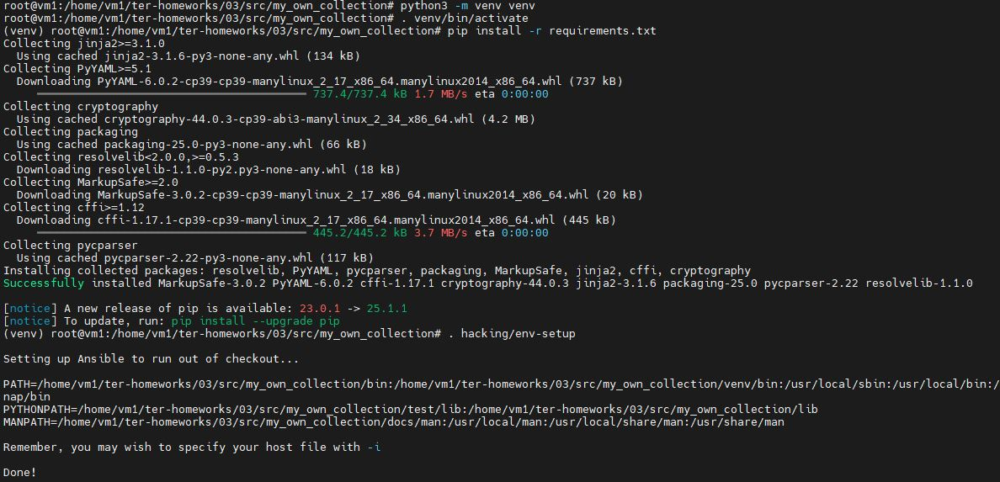

2. 

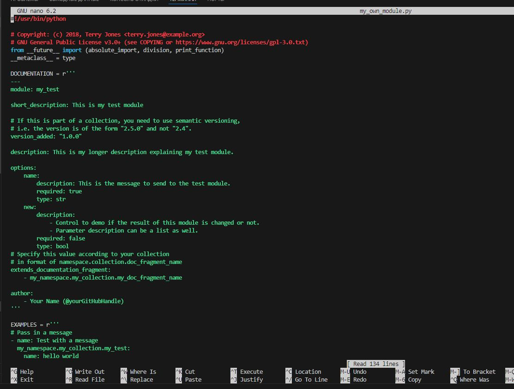

4. 

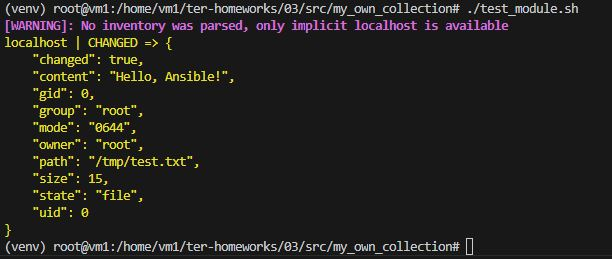

5.

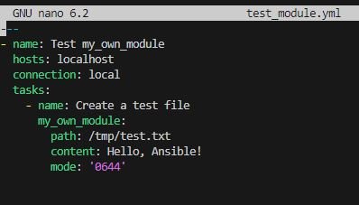

6. 

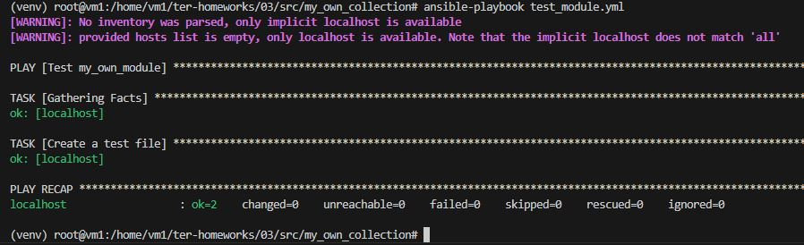
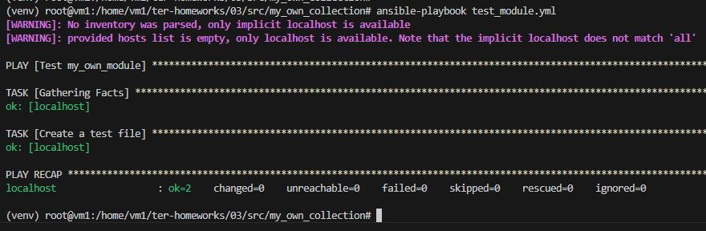

7.

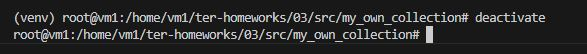

8. 

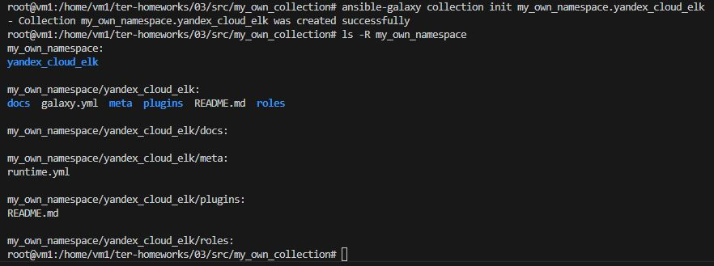

11. 

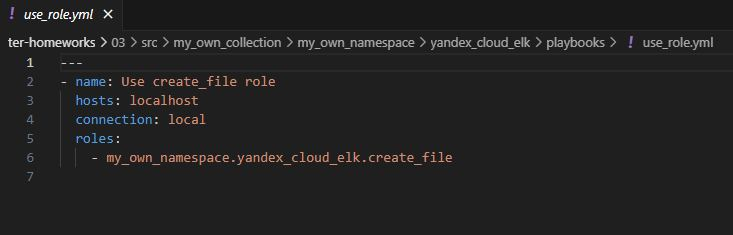

13. 

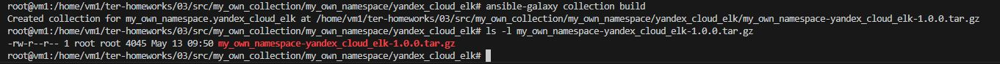

14. 

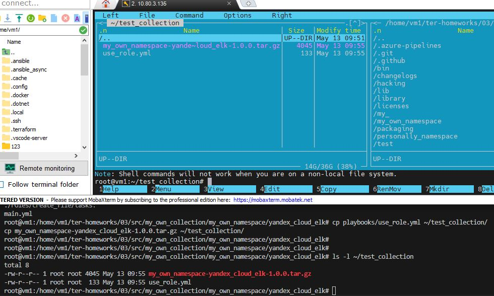

15. 

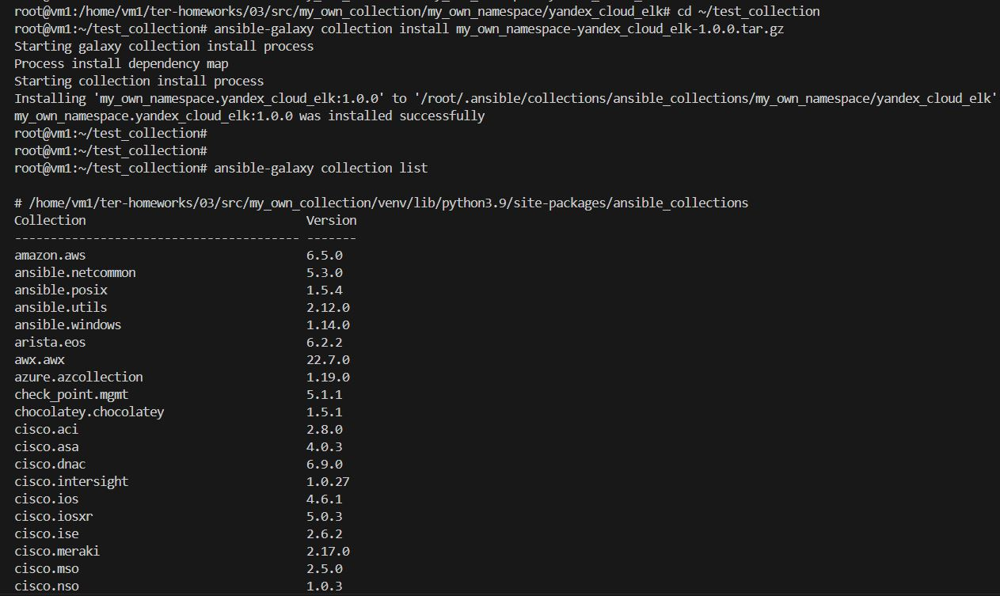

16. 

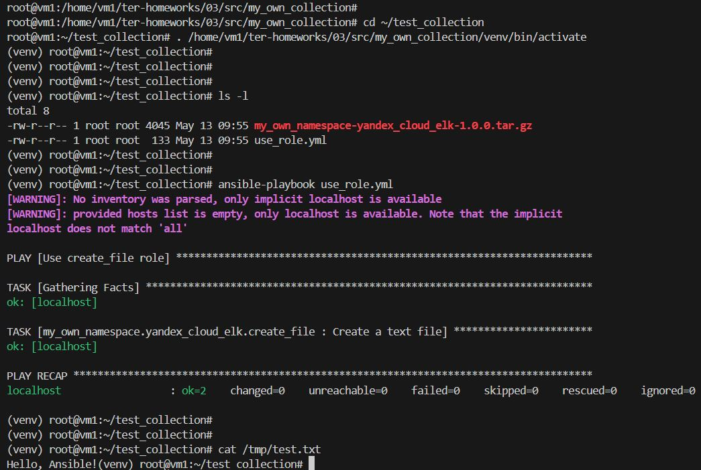